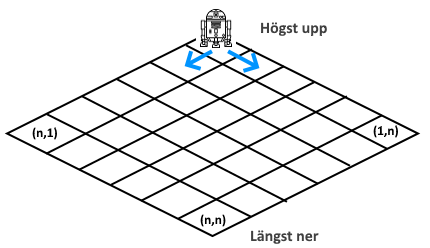

# Trött Robot

En robot befinner sig i övre hörnet på ett sluttande plan i form av ett kvadratiskt rutnät av storlek *n* gånger *n*. Hela planet är täckt av tjock snö och roboten har inte så mycket laddning kvar, så den behöver utnyttja planets lutning för att orka genomföra sitt uppdrag innan batteriet tar slut. Uppdraget är att samla ihop *en viss angiven mängd osmium, varken mer eller mindre*, och transportera det till det nedersta hörnet på det sluttande planet. I varje steg kan roboten röra sig antingen en ruta snett ned till vänster eller en ruta snett ned till höger, vilket innebär att den från ruta (*i*,*j*) kan röra sig antingen till (*i*+1,*j*) eller (*i*,*j*+1), se bilden. Men vid ett (och endast ett) tillfälle under vandringen orkar roboten backa till rutan som den just kom ifrån (vilket innebär att den åker i uppförsbacke - att det ens är möjligt beror på att snön är nedtrampad av roboten i alla rutor som den passerat). Roboten kan aldrig röra sig utanför planet (rutnätet).

Som tur är känner vi till exakt hur mycket osmium som finns att hämta i varje ruta i rutnätet. I ruta (x,y) finns Os[x,y] gram osmium (ett ickenegativt heltal). Första gången roboten når en ruta samlar den in allt osmium som finns i den rutan, så om roboten återkommer till samma ruta en andra gång så finns det inget osmium kvar i rutan att samla in. Det kan ändå vara givande för roboten att backa tillbaka till rutan som den just kom ifrån eftersom den då har möjlighet att välja en annan väg än den tog förra gången. Som sagt orkar den bara backa vid ett tillfälle så det gäller att välja det tillfället väl.

*Tröttarobotproblemet* är att, givet heltal *n* och *m* samt matrisen Os[1..*n*, 1..*n*], avgöra om det är möjligt för roboten att samla in exakt *m* gram osmium på sin väg från startrutan (1,1) till slutrutan (*n*,*n*).

Visa att *tröttarobotproblemet* är NP-fullständigt genom att dels visa att det ligger i NP och dels utforma en polynomisk Karpreduktion mellan det känt NP-fullständiga problemet *delmängdssumma* (se föreläsning 25) och *tröttarobotproblemet*.

I exemplet nedan har roboten rört sig ned till ruta (5,4) och kan nu backa tillbaka till ruta (4,4):

